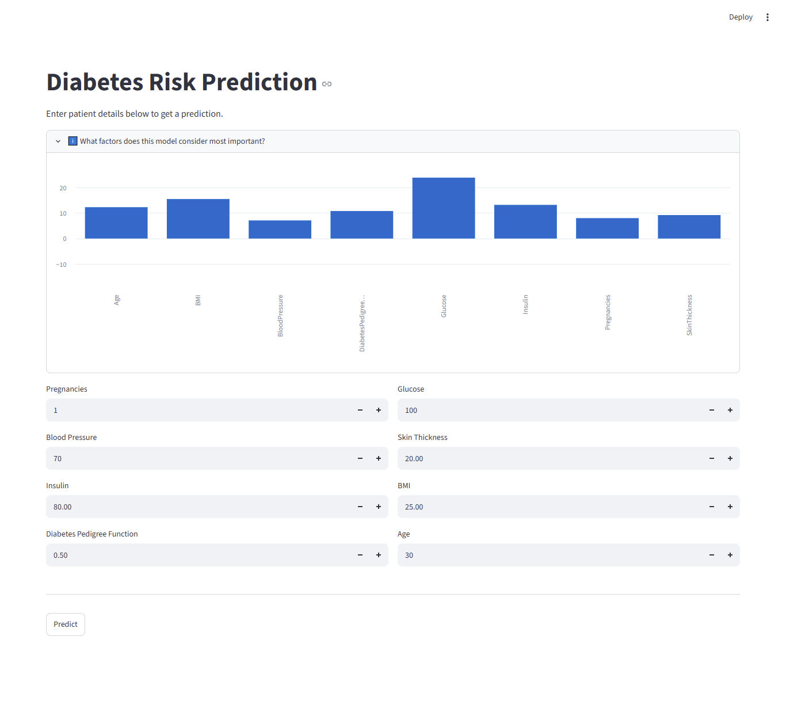

# Diabetes Risk Prediction App

A machine learning web application that predicts a patient's diabetes risk based on key health metrics (glucose, BMI, insulin, etc.), built with a full end-to-end pipeline: data cleaning, model comparison, and a FastAPI + Streamlit deployment.

This project was built as part of my self-learning journey toward becoming an Agentic AI Developer / ML Engineer.

---

## Demo





## Dataset & Problem

This model was trained on the **Pima Indians Diabetes Database**, sourced from Kaggle. It predicts whether a patient is likely to be **Diabetic** or **Non-Diabetic** based on 8 health-related input features.

The dataset contained missing values recorded as zeros in several columns. Columns with a small percentage of zeros (Glucose, BloodPressure, BMI) were dropped, since removing them had negligible impact on the dataset. Columns with much higher missingness (Insulin, SkinThickness) were imputed using the median value grouped by a biologically related feature — Insulin was imputed using Glucose ranges, and SkinThickness was imputed using BMI ranges — rather than a single global median, to preserve more meaningful signal.

It's also worth noting that this dataset is drawn from the Pima Indian population, which has a notably higher prevalence of diabetes than the general population. As a result, the model's predictions may not generalize well to other populations without further validation.

---

## Model Training & Comparison

Four model variants were trained and compared, with a focus on **recall** for the diabetic class (missing a real diabetic case is more costly than a false alarm in a screening context):

| Model | Precision (Diabetic) | Recall (Diabetic) | F1 (Diabetic) |
|---|---|---|---|
| Logistic Regression (baseline) | 0.58 | 0.52 | 0.55 |
| Logistic Regression (balanced) | 0.53 | 0.66 | 0.59 |
| Random Forest (default) | 0.60 | 0.60 | 0.60 |
| **Random Forest (balanced)** | **0.60** | **0.62** | **0.61** |

**Random Forest (balanced)** was selected as the final model — it offered the best overall balance between precision and recall (highest F1-score), avoided the sharp precision drop seen in Logistic Regression (balanced), and provides feature importance for interpretability.

### Feature Importance

The trained Random Forest ranks **Glucose** as the strongest predictor, followed by **BMI** and **Insulin** — consistent with known clinical risk factors for diabetes.

---

## Tech Stack

- **Python** — core language
- **Pandas / NumPy** — data cleaning and manipulation
- **scikit-learn** — preprocessing (StandardScaler), model training (Random Forest), evaluation
- **FastAPI** — backend API serving predictions
- **Streamlit** — frontend web UI
- **joblib** — model serialization

---

## Project Structure

```
diabetes-prediction-api/
├── Diabetes_ZI.ipynb        # Data cleaning, model training, comparison
├── diabetes.csv              # Dataset
├── diabetes_model.pkl        # Saved trained pipeline (scaler + model)
├── feature_importance.csv    # Feature importance values
├── main.py                   # FastAPI backend
├── app.py                    # Streamlit frontend
├── requirements.txt          # Python dependencies
└── README.md                 # Project documentation
```

---

## How to Run Locally

1. Clone/download this repository
2. Create and activate a virtual environment:
   ```
   python -m venv venv
   venv\Scripts\activate
   ```
3. Install dependencies:
   ```
   pip install -r requirements.txt
   ```
4. Start the FastAPI backend:
   ```
   uvicorn main:app --reload
   ```
5. In a separate terminal, start the Streamlit frontend:
   ```
   streamlit run app.py
   ```
6. Open the URL shown in the terminal (usually `http://localhost:8501`)

---

## Limitations

- Trained on a relatively small dataset (~750 rows after cleaning), which limits model robustness
- The Pima Indian population's higher diabetes prevalence may limit generalizability to other populations
- This is a learning project and is **not intended for real medical diagnosis**

---

## Future Improvements

- Deploy publicly (FastAPI backend + Streamlit Community Cloud frontend)
- Add per-prediction explanations (e.g. SHAP values) instead of only global feature importance
- Expand the dataset or validate against a more diverse population

---

## Author

Javed — Islamiat teacher and self-taught AI/ML learner, working toward becoming an Agentic AI Developer.
